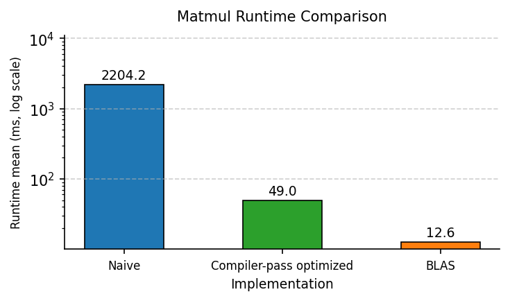

# Tensor Reduction Operation Compiler

#### Check [DEMO](https://github.com/hkyoon94/mm-compiler/blob/main/demo.ipynb) file for demonstration.

A toy project for **end-to-end tensor reduction operation compiler**, providing

- simple frontend instruction parser,
- decent middle-end optimization passes, and
- backend support for target specific code-emission (e.g., to C++) and JIT compiled runtime.

1. simple frontend instruction parser:
    ```r
    import src.frontend as fe

    # Example: indicates M, K, N = 1024, 768, 512 matmul kernel IR
    ir = fe.parse("[1024, 1024] @ [1024, 1024]")
    ```
2. middle-end optimization passes, such as `.legalize()`, `.tile()`, `.reorder()`, and `.promote_invariants()`, etc.:
    - Ex1) Legalizing Frontend expressions:
        ```r
        ir.legalize()
        print(ir)

        # >>> output >>>
        @IR.mm
        for (m in 0..1024) {
          for (n in 0..1024) {
            for (k in 0..1024) reduction {  // reduction over k
              %a_1 = load A[m, k]
              %b_1 = load B[k, n]
              %mul_1 = mul %a_1, %b_1
              accumul %mul_1, C[m, n]
            }
          }
        }
        ```
    - Ex2) Block-tiling loops:
        ```r
        ir.tile(tile_sizes={'m': 256, 'n': 256, 'k': 256})
        print(ir)

        # >>> output >>>
        @IR.mm
        for (m_blk in 0..1024//256) {
          for (m_inner in 0..256) {
            for (n_blk in 0..1024//256) {
              for (n_inner in 0..256) {
                for (k_blk in 0..1024//256) {
                  for (k_inner in 0..256) reduction {  // reduction over k_inner
                    %a_1 = load A[(m_blk * 256 + m_inner), (k_blk * 256 + k_inner)]
                    %b_1 = load B[(k_blk * 256 + k_inner), (n_blk * 256 + n_inner)]
                    %mul_1 = mul %a_1, %b_1
                    accumul %mul_1, C[(m_blk * 256 + m_inner), (n_blk * 256 + n_inner)]
                  }
                }
              }
            }
          }
        }
        ```
3. And backend support for target specific code-emission and JIT compiled runtime:
    ```r
    import torch
    from src.compile import emit, Runtime
    from src.constants import Targets

    mod = Runtime.jit(emit(me_ir, target=Targets.C, name="mm"))

    a = torch.randn(1024, 1024)
    b = torch.randn(1024, 1024)
    c = mod.mm(a, b)

    print(c)

    # >>> output >>>
    tensor([[  5.3988, -27.3241,  27.8568,  ...,  55.6724,  45.9172,  -8.6301],
            [-11.2728, -69.2085, -22.5679,  ...,  31.5664, -34.8473,  81.9369],
            [  6.8330, -31.1498,   1.6498,  ...,  -4.0019,  22.9739, -36.1179],
            ...,
            [-23.6425,  -4.6717, -20.8179,  ..., -28.1477, -18.8541,   5.7671],
            [-16.5857,   9.2976,   5.3926,  ...,  34.6411,  -0.2485,  -4.1970],
            [ 18.2749,  -4.9628,  -4.4434,  ..., -72.8047,  -9.5710,  15.6376]])
    ```


